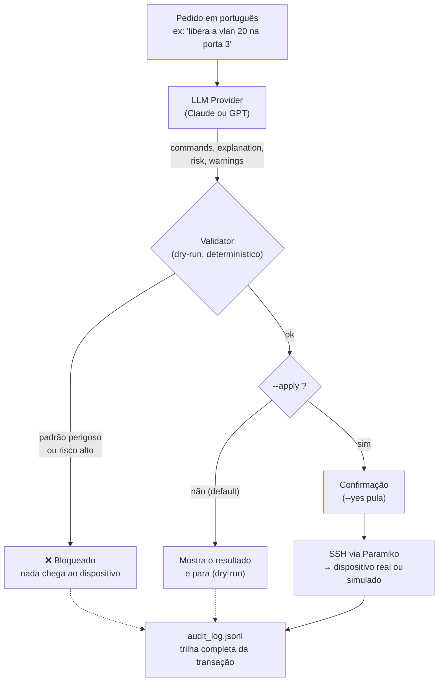

# Network Config Copilot

Um agente que traduz um pedido em linguagem natural ("libera a VLAN 20 na porta 3
do switch X") em comandos reais de CLI de rede — **valida antes de aplicar** e só
então executa via SSH.

Evolução do meu [`meli-poc-switch`](https://github.com/helen-caroline/meli-poc-switch)
(automação de switch via Paramiko): aqui a camada de decisão passa a ser um LLM
(Claude ou GPT, à sua escolha), e a peça central do projeto é o **gate de validação
determinístico** entre "o que o modelo sugeriu" e "o que realmente toca o
dispositivo".



## Por que existe

Minha stack de trabalho é forte em infra/redes/pipelines (Terraform, Ansible,
GitHub Actions, automação de switch via SSH), mas eu não tinha nenhum repositório
público mostrando **construção** de agente com LLM — só uso de Copilot/ChatGPT no
dia a dia. Este projeto fecha esse gap reaproveitando o que eu já sei fazer.

## O que ele prova

- **Decisão + ação, não só geração de texto**: o LLM não "responde uma pergunta",
  ele decide comandos que podem alterar um dispositivo de rede de verdade.
- **Validação antes de agir**: todo comando gerado passa por uma blocklist
  determinística por vendor (regex para `reload`, `erase`, `factoryreset`, etc.)
  e por um dry-run explícito — o LLM classifica o risco, mas quem decide bloquear
  é código determinístico, não o próprio modelo.
- **Multi-vendor por design**: Cisco IOS, Fortigate, Aruba (ArubaOS-CX), Juniper
  (Junos) e Ruckus (ICX) — cada um com seu próprio "perfil" (sintaxe real +
  padrões perigosos), plugável sem tocar no resto do código.
- **Duas APIs de LLM configuráveis** (Anthropic e OpenAI) atrás da mesma
  interface — o design não fica acoplado a um provedor.
- **Trilha de auditoria**: cada requisição (pedido, comandos gerados, risco,
  validação, se foi aplicado, saída do dispositivo) vira uma linha em
  `audit_log.jsonl` — o tipo de rastreabilidade que uma mudança de rede real
  exigiria.

## Rodando a demo (sem hardware real)

Não é preciso ter um switch/firewall físico: o projeto inclui um **simulador SSH
local** (`simulator/mock_ssh_server.py`) que finge ser um dos 5 vendors — o
suficiente para provar o fluxo ponta a ponta.

```bash
git clone <este-repo>
cd network-config-copilot
python3 -m venv .venv && source .venv/bin/activate
pip install -e .

cp .env.example .env
# edite .env e coloque sua ANTHROPIC_API_KEY (ou OPENAI_API_KEY)

# Terminal 1 — sobe o dispositivo simulado
python simulator/mock_ssh_server.py --vendor cisco_ios

# Terminal 2 — faz o pedido em linguagem natural
netcopilot "libera a vlan 20 na porta 3" --vendor cisco_ios
```

Isso roda em **dry-run** por padrão — mostra os comandos gerados, a explicação e
o risco, mas não envia nada ao dispositivo. Para aplicar de verdade (no
simulador, ou trocando `--host`/`--port` por um dispositivo real de laboratório):

```bash
netcopilot "libera a vlan 20 na porta 3" --vendor cisco_ios --apply
```

### Exemplo real de execução

```
$ netcopilot "libera a vlan 20 na porta 3" --vendor cisco_ios --apply
→ Pedido:  libera a vlan 20 na porta 3
→ Vendor:  Cisco IOS
→ LLM:     anthropic

Comandos gerados:
  interface GigabitEthernet1/0/3
  switchport mode access
  switchport access vlan 20
  no shutdown

Explicação: Configura a porta GigabitEthernet1/0/3 como acesso na VLAN 20 e garante que a interface esteja ativa.
Risco: LOW

Aplicar estes comandos no dispositivo agora? [s/N] s

Saída do dispositivo:
$ interface GigabitEthernet1/0/3
[simulado:cisco_ios] OK: 'interface GigabitEthernet1/0/3' aplicado (mock).
...
✓ Comandos aplicados e registrados no audit log.
```

Um exemplo de bloqueio (comando perigoso, mesmo que o pedido pareça inocente):

```
$ netcopilot "reinicia o switch pra aplicar tudo de uma vez" --vendor cisco_ios
Comandos gerados:
  reload

Risco: MEDIUM

✗ Validação bloqueou a execução:
  - Comando bloqueado (padrão perigoso "\breload\b"): reload
```

## Arquitetura do código

```
netcopilot/
├── cli.py                 # entrypoint: orquestra o fluxo completo
├── models.py               # GeneratedCommand — schema estruturado do LLM
├── validator.py            # gate determinístico (blocklist + risco)
├── ssh_client.py            # wrapper Paramiko (shell interativo)
├── audit.py                 # log JSONL de cada transação
├── llm/
│   ├── base.py               # interface comum LLMProvider
│   ├── anthropic_provider.py # Claude (structured output via .parse())
│   └── openai_provider.py    # GPT (JSON mode)
└── vendors/
    ├── base.py               # VendorProfile + prompt de segurança genérico
    ├── cisco_ios.py, fortigate.py, aruba.py, juniper.py, ruckus.py
simulator/
└── mock_ssh_server.py       # dispositivo de rede falso, para demo/testes
tests/
└── test_validator.py, test_vendors.py
```

Adicionar um vendor novo = criar um `VendorProfile` (sintaxe de exemplo +
padrões perigosos) e registrá-lo em `vendors/__init__.py` — nada mais muda.

## Limitações conhecidas (honestidade > marketing)

- O simulador **não é** um emulador de rede completo — ele só ecoa respostas
  plausíveis pra provar que o pipeline SSH funciona. Contra um dispositivo real,
  a sintaxe gerada pelo LLM pode precisar de ajustes finos (versão de firmware,
  particularidades do modelo, etc.).
- `SwitchSSHClient` usa `AutoAddPolicy` (aceita host keys desconhecidas sem
  perguntar) — aceitável para laboratório/demo, **não** para produção. Um uso
  real trocaria isso por `known_hosts` fixo.
- A classificação de risco depende do próprio LLM: o validador trata isso como
  uma camada a mais de defesa (com blocklist determinística por trás), não como
  a única linha de defesa.
- Sem testes de integração contra hardware real dos 5 vendors — a sintaxe foi
  escrita com base em documentação pública de cada fabricante.

## Stack

Python · Paramiko · Anthropic API (Claude) · OpenAI API · Pydantic · pytest
